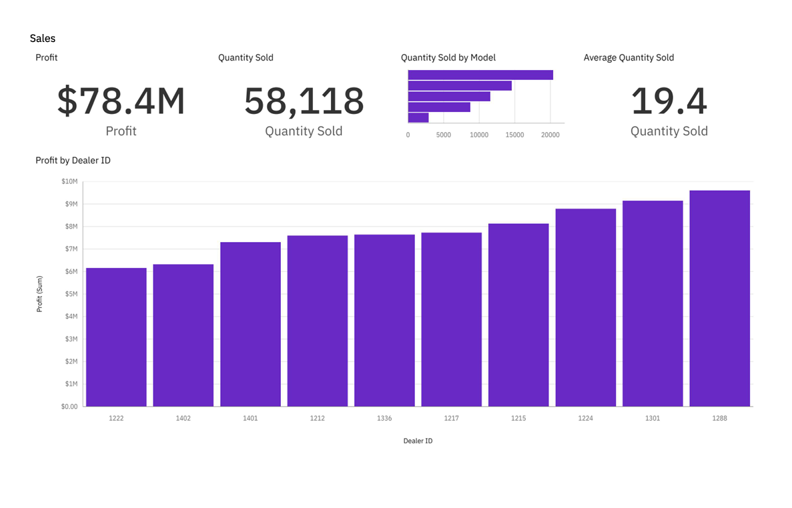
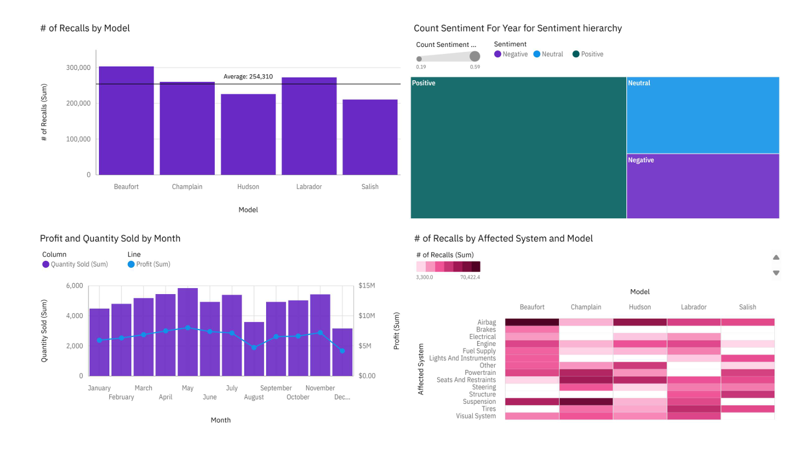

# IBM Cognos Dashboard – Sales & Service Analysis

This project showcases two interactive dashboards built using **IBM Cognos Analytics** as part of the "Creating Visualizations Using Cognos Analytics" hands-on lab in the IBM Data Analyst Professional Certificate on Coursera.

---

## 📊 Overview

As a **Regional Manager** for a chain of car dealerships, the goal is to build dashboards to analyze and compare **sales** and **service** performance across different models, dealers, and time periods.

Two dashboards were created:
- **Sales Dashboard**
- **Service Dashboard**

Each dashboard uses visualizations and KPIs to help drive data-informed decisions.

---

## 🛠️ Tools Used

- **IBM Cognos Analytics**
- **Auto Group Data Module** (Sample data from IBM Accelerator Catalog)

---

## 📁 Files

| File | Description |
|------|-------------|
| `dashboards/sales_dashboard.pdf` | PDF version of the Sales Dashboard |
| `dashboards/service_dashboard.pdf` | PDF version of the Service Dashboard |

---

## 💡 Key Insights

### 📈 Sales Dashboard
- **Total Profit**: $78.4M
- **Top Models by Quantity Sold**:
  - `Hudson`: ~20K units
  - `Labrador`: ~15K units
- **Lowest-Selling Models**:
  - `Champlain`: ~3K units
  - `Beaufort`: ~8.5K units
- **Top Dealers by Profit**:
  - `Dealer ID 1288`: > $1.4M (also has highest Quantity Sold)
  - `Dealer ID 1301`: ~ $1.4M
- **Top Dates by Profit**:
  - `June 2, 2024`: $1.73M
  - `May 2, 2024`: $1.71M

### 🛠️ Service Dashboard
- **Most Recalls by Model**:
  - `Beaufort`: > 303K recalls
  - `Labrador`: ~273K recalls
- **Most Affected System**:
  - `Airbag` (highest total # of recalls)
- **Sentiment Analysis**:
  - `Positive`: 59%
  - `Neutral`: 22%
- **Monthly Sales Trends**:
  - `May`: Highest sales (~6K units)
  - `December`: Lowest (~3K units)
  - Sales dropped **42% from November to December**

---

## 📌 Dashboard Design Summary

### 🔷 Sales Dashboard (Tabbed layout with 4 KPIs + 1 detailed chart)
- Panel 1: Profit (formatted in millions, 1 decimal)
- Panel 2: Quantity Sold
- Panel 3: Quantity Sold by Model (bar chart)
- Panel 4: Average Quantity Sold
- Panel 5: Profit by Dealer ID (column chart, sorted ascending)

### 🔶 Service Dashboard (2x2 grid layout)
- Panel 1: Number of Recalls per Model (column chart)
- Panel 2: Sentiment Distribution (treemap)
- Panel 3: Monthly Sales vs Profit (line + column chart)
- Panel 4: Recalls by Model & System (heat map)

---

## ✅ Skills Demonstrated

- Business Intelligence (BI) Reporting
- Interactive Dashboard Design
- KPI Visualization
- Data Storytelling
- IBM Cognos Analytics

---

## 📷 Preview

Click to view screenshots

---

## © Credits

- Assignment from: [IBM Data Analyst Professional Certificate (Coursera)](https://www.coursera.org/professional-certificates/ibm-data-analyst)
- Instructor(s): Steve Ryan, Sandip Saha Joy  
- Data Source: IBM Accelerator Catalog (Auto group data module)

